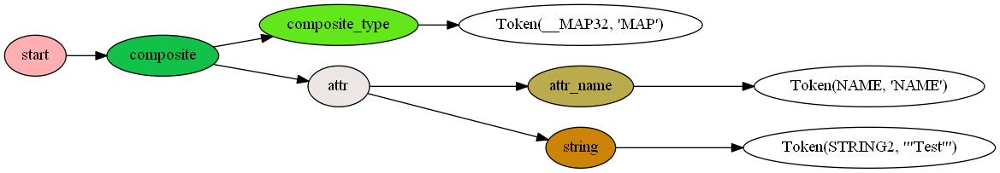
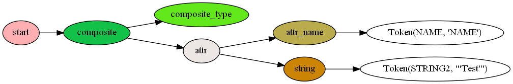
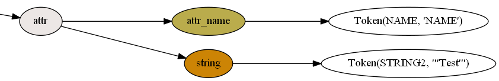
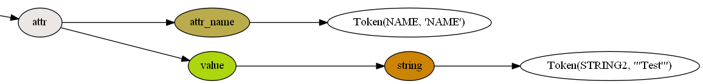
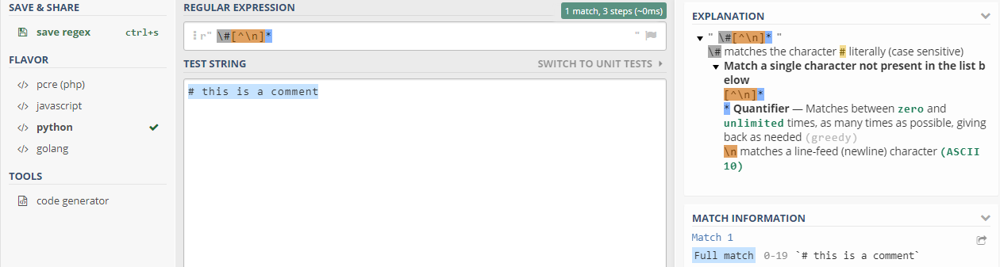

Explaining the Mapfile Grammar
==============================

For a great introduction to Lark, the general purpose parsing library used by mappyfile see the 
`Lark reference page <https://github.com/erezsh/lark/blob/master/docs/reference.md>`_. 

The full Mapfile grammar file is shown at the end of this page. The latest version can be seen `here on 
GitHub <https://github.com/geographika/mappyfile/blob/master/mappyfile/mapfile.g>`_. 

A Simple Example
----------------

The easiest way to understand how the parser and grammar work is to go through a short example. We will use the Mapfile snippet 
below to parse and turn into an AST (Abstract Syntax Tree). 

.. code-block:: mapfile

    MAP
        NAME 'Test'
    END

This produces the following tree (click for the full-size version). 

The tree is stored as a Python object, shown below:

.. code-block:: python

    Tree(start, [Tree(composite, [Tree(composite_type, [Token(__MAP32, 'MAP')]), Tree(attr, [Tree(attr_name, [Token(NAME, 'NAME')]), Tree(string, [Token(STRING2, "'Test'")])])])])

The grammar file contains rules and `terminals <http://www.parsifalsoft.com/gloss.html#Terminal>`_, and the parser matches these to the input text to create the tree. 

We will now go through all the rules matched by our example Mapfile. 

The first rule ``start`` will always be at the root of the tree:

.. code-block:: javascript

    start: _NL* composite _NL*

The rule checks for a ``composite`` rule, surrounded by zero to many (denoted by **\***) new lines. 
The newline terminal ``_NL`` is defined at the end of the grammar file. 

Next we'll look at the ``composite`` rule:

.. code-block:: javascript

    composite: composite_type attr? _NL+ composite_body _END
           | composite_type points _END
           | composite_type pattern _END
           | composite_type attr _END

This rule is matched by a list of options - each on its own line starting with the **|** (pipe) character. When writing or debugging a grammar
you can comment out options to see which one matches for a particular input. 

In our example the Mapfile matches the last option ``composite_type attr _END``, which cab ne broken down as follows:

+ a ``composite_type`` rule (in this case ``MAP``)
+ an ``attr`` rule
+ the ``_END`` terminal (the literal string "END")

As each rule creates a new branch on the tree a new ``composite`` branch is created from the ``start`` branch. 

.. code-block:: javascript

    !composite_type: "CLASS"i // i here is used for case insensitive matches, so CLASS, Class, or class will all be matched             
                | "LEGEND"i
                | "MAP"i
                // list cut for brevity

The ``composite_type`` rule again has a list of options, but in this case consists of string literals. The **!** before the rule name means the 
rule will keep all their terminals. Without the **!** the tree would look as below - note the ``MAP`` value is missing from the ``composite_type`` branch. 

Next we look at the ``attr`` rule:

.. code-block:: javascript
  
    attr: attr_name value+

This consists of 2 further rules. An ``attr_name`` match and one or more ``value`` rules (the + denotes one or more matches). A new ``attr``
branch is added to the tree with these rules as children. 

The ``attr_name`` rule is as follows:

.. code-block:: javascript

    attr_name: NAME | composite_type
    
Rules can be matched recursively so one of the ``attr`` of a ``composite_type`` can be another ``composite_type``. This allows us to parse
nested composite types such as a ``CLASS`` in a ``LAYER`` in a ``MAP``. 

In our example however the rule is matched by the ``NAME`` terminal. This is defined using a regular expression to for a matching string:

.. code-block:: javascript

    NAME: /[a-z_][a-z0-9_]*/i

The regular expression can be explained as follows:

+ ``[a-z_]`` - a single letter from a to z, or an underscore
+ ``[a-z0-9_]`` - a single letter from a to z, a number from 0-9, or an underscore
+ the ``*`` indicates zero to many matches
+ the ``i`` indicates a case-insensitive search

Therefore the following strings would all match: ``NAME, name, Name, NAME_, MY_NAME``, however ``'NAME', My Name, N@me`` would not. 

The final rule matched in our example is the ``value`` rule. 

.. code-block:: javascript

    ?value: bare_string | string | int | float | expression | not_expression | attr_bind | path | regexp | runtime_var | list

The **?** preceding the rule causes it to be "inlined" if it has a single child. This means a new branch isn't created for the ``value`` rule, and its
child is added directly to the branch. The tree with "inlining" results in: 

And without inlining (the **?** character), the ``value`` branch is missing:

This example covers a large number of the rules in the grammar file, and hopefully provides a basis for understanding the more complicated rules. 

Terminals
---------

Terminals are displayed in uppercase in the grammar file. They are used to match tokens using string literals, regular expressions, or combinations
of other terminals. 

If the terminal is proceeded by an underscore it won't appear in the tree, for example the closing blocks of each of the composite types:

.. code-block:: javascript

    _END: "END"i

Many of the terminals make use of regular expressions to match tokens. The site https://regex101.com/ provides useful explanations of these. 
Remember to set the Python "Flavor" and to remove the surrounding forward slashes. 

For example to get an explanation of ``COMMENT: /\#[^\n]*/`` enter ``\#[^\n]*``:

Some further explanations are below:

.. code-block:: javascript

    // check for path names e.g. /root/logs
    PATH: /[a-z_]*[.\/][a-z0-9_\/.]+/i

Grammar File
------------

The full Mapfile grammar is shown below. 

.. literalinclude:: ../mappyfile/mapfile.g
   :language: javascript
