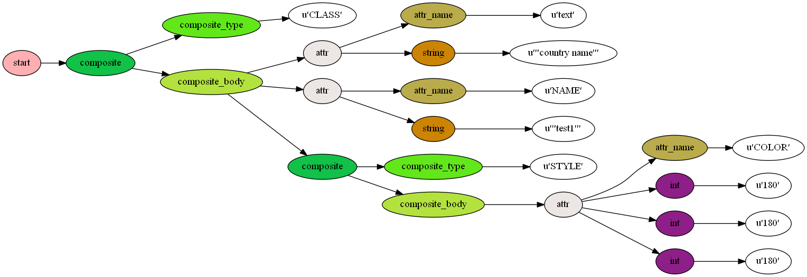
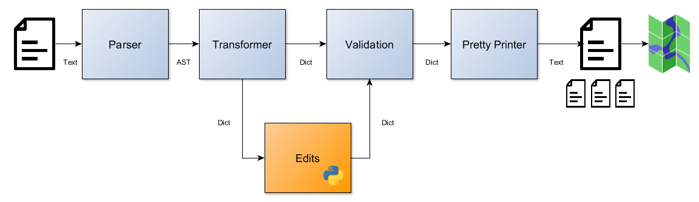

mappyfile
=========

A Python library to create, parse, modify, and format `MapServer <http://mapserver.org/documentation.html>`_ Mapfiles. 

+ Python 2 and 3 compatible
+ Pure Python - no MapServer dependencies
+ Open Source License (MIT)

An online formatter demonstrating the libraries capabilities can be found at: http://mappyfile.geographika.net/

A presentation on mappyfile was given at `FOSS4G Europe 2017 <https://europe.foss4g.org/2017/Home>`_ - slides are available 
:download:`to download here <_static/foss4ge2017_mappyfile_sgirvin.pdf>`.

.. toctree::
    :maxdepth: 2
    :numbered:
    :titlesonly:

    Parsing (draft) <parser.rst>
    Transforming (draft) <transformer.rst>
    Pretty Printing <pretty_printing.rst>
    validation.rst
    schemas.rst
    grammar.rst
    python_integration.rst
    client.rst
    api/main.rst
    development.rst

What is mappyfile?
------------------

*mappyfile* takes a Mapfile as input and parses it into an `Abstract syntax tree (AST) <https://en.wikipedia.org/wiki/Abstract_syntax_tree>`_ 
using `lark <https://github.com/erezsh/lark>`_ a Python parsing library. 
mappyfile can then transform the AST into a dictionary structure, containing keys and values of dicts, and lists familiar to
Python programmers. This structure can be edited directly. Alternatively new objects can be added by parsing further Mapfile text and inserting into the 
dictionary structure. mappyfile also includes a "pretty printer" to export this dictionary structure back to a Mapfile, with keyword formatting and indentation. 

*mappyfile* assumes knowledge of the Mapfile format - a `domain specific language (DSL) <https://en.wikipedia.org/wiki/Domain-specific_language>`_ used
by MapServer to generate map images. mappyfile is a possible alternative to using MapScript. The definitions of these (from the 
`MapServer glossary <http://mapserver.org/el/glossary.html>`_) are shown below:

+ **Mapfile** is the declarative language that MapServer uses to define data connections, 
  map styling, templating, and server directives. Its format is xml-like and hierarchical, 
  with closing END tags, but the format is not xml.

+ **MapScript** is an alternative to the CGI application of mapserv that allows you to 
  program the MapServer object API in many languages.

The diagram below shows the different elements of mappyfile, and how they are used to modify a Mapfile:

Why?
----

* Easily generate development, staging, and production Mapfiles from the same source Mapfile
* Create Mapfiles for different datasets from a single Mapfile
* Create, manipulate, and test Mapfiles from within Python

The current alternative to building applications with MapServer is to use MapScript. This approach has a
number of issues that resulted in the development of mappyfile:

+ When running on Windows any Python libraries using C/C++ require them to be built with the MS C/C++ VS2008 compiler, this means no applications using MapScript
  can take advantage of performance improvements in the MS C/C++ 2015 compiler
+ You need to create an empty log file or MapServer won't open the map (or get "msSetErrorFile(): General error message. Failed to open MS_ERRORFILE" errors)
+ MapScript is not available through PyPI - the last version was uploaded in 2010 - https://pypi.python.org/pypi/mapscript/5.6.3.0 **UPDATE** mapscript wheels 
  for MapServer 7.2 on Windows are now available
+ It is necessary to set the working directory so that MapServer includes are found (this also applies to mappyfile, but there is no need to os.chdir
  and change the working directory for your script or application)
+ The MapScript API is not particularly "Pythonic"

One key difference is that mappyfile only deals with text, so you cannot retrieve features or connect to databases through layers as you can with MapScript. 
mappyfile's approach is to build a Mapfile that then uses the mapserv program to handle these requirements. This design was influenced by Sean Gillies,
the MapScript maintainer for several years (until 2006). A couple of his last blog posts on MapScript make a strong case for working with Mapfiles rather than MapScript:  

    *"Cease, or at the very least, minimize your use of MapServer's various language bindings. 
    Instead, embrace MapServer's domain-specific language (DSL) and write more of the declarative 
    cartographic scripts known as mapfiles. Use the mapserv (or shp2img) program to compile these 
    scripts into images. This is the path to happiness and prosperity."*

    Sean Gillies - `Stop using MapScript`_

A later post listed the benefits of this approach:

    *"the instructions encoded in a MapServer mapfile comprise a domain-specific language..
    to embrace the map language is to benefit from simplicity, usability, and portability."*

    Sean Gillies - `Declarative Maps`_

The concept of the Mapfile as a DSL has been implemented a few times. A Python `Mapfile builder`_ written by Allan Doyle used an XML approach.

More recently the Node module `node-mapserv`_ provides support for declarative mapfile programming. 
As the author notes: 

    *node-mapserv is not MapScript for Node. Instead it provides a simple declarative API for 
    rendering mapserver mapfiles..most of what can be accomplished imperatively 
    using mapscript can be done declaratively by custom generating new mapfiles and tweaking 
    existing mapfiles*

As an interesting footnote the MapScript "bindings" are available in several different languages thanks to `SWIG <https://en.wikipedia.org/wiki/SWIG>`_ which creates wrapper 
code for C. SWIG was developed by `David Beazley <http://www.dabeaz.com/>`_, who then later built `PLY <http://www.dabeaz.com/ply/>`_ on which mappyfile was originally based. 
PLY is an implementation of lex and yacc parsing tools for Python - the tools MapServer itself uses to parse Mapfiles in C. 

Code Examples
-------------

This section details the basic use of the ``mappyfile`` library. For all functionality and examples see the :ref:`mappyfile-api` documentation. 

Accessing Values
++++++++++++++++

.. literalinclude:: examples/api/accessing_values_test.py
    :language: python
    :dedent: 4
    :start-after: # START OF API EXAMPLE
    :end-before: # END OF API EXAMPLE

Query
+++++

.. literalinclude:: examples/api/search_test.py
    :language: python
    :dedent: 4
    :start-after: # START OF API EXAMPLE
    :end-before: # END OF API EXAMPLE
    
Modifying Values
++++++++++++++++

.. literalinclude:: examples/api/modifying_values_test.py
    :language: python
    :dedent: 4
    :start-after: # START OF API EXAMPLE
    :end-before: # END OF API EXAMPLE

Adding Items
++++++++++++

Adding a new layer:

.. literalinclude:: examples/api/adding_values_test.py
    :language: python
    :dedent: 4
    :start-after: # START OF ADD LAYER EXAMPLE
    :end-before: # END OF ADD LAYER EXAMPLE

Adding a new class to a layer:

.. literalinclude:: examples/api/adding_values_test.py
    :language: python
    :dedent: 4
    :start-after: # START OF ADD CLASS EXAMPLE
    :end-before: # END OF ADD CLASS EXAMPLE

Development Roadmap
-------------------

Future development plans, leading to a v1.0 release include:

+ Setup an easy way to plug in "linters" to check various Mapfile settings and rules (e.g. configured correctly for WFS)
+ Create a Jupyter Notebook demonstrating mappyfile usage
+ Add a plugins page to the docs
+ Add an example of creating Mapfiles using YAML
+ Create a new ``prune`` function to remove redundant default settings from a Mapfile

.. include:: HISTORY.rst

.. _Stop using MapScript: https://sgillies.net/2006/11/29/stop-using-mapscript.html
.. _Declarative Maps: https://sgillies.net/2006/12/01/declarative-maps.html
.. _Mapfile builder: https://web.archive.org/web/20090106070607/http://think.random-stuff.org/FrontPage/archive/2006/07/mapfile-builder
.. _node-mapserv: https://www.npmjs.com/package/mapserv
