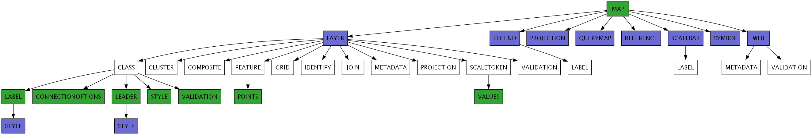
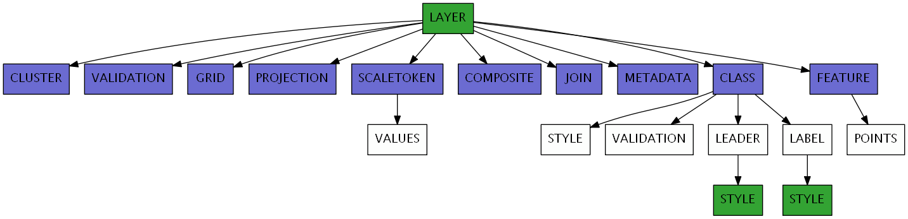

Parsing
=======

*Please note this page is currently a draft and subject to further updates.*

mappyfile uses `lark <https://github.com/erezsh/lark>`_ as the parsing engine. 

Keywords
++++++++

+ All the tokens used by MapServer are listed in the following file: https://github.com/mapserver/mapserver/blob/master/maplexer.l
+ Keywords are also listed at: http://mapserver.org/mapfile/index.html
+ There is also a Sphinx RegexLexer for code formatting at https://github.com/mapserver/docs/blob/master/conf.py (see bottom of file)

MapFiles
++++++++

Details on the structure of the Mapfile can be found at: http://mapserver.org/mapfile/#notes

+ The Mapfile is NOT case-sensitive
+ Strings containing non-alphanumeric characters or a MapServer keyword MUST be quoted. It is recommended to put ALL strings in double-quotes.
+ The Mapfile has a hierarchical structure, with the MAP object being the root All other objects fall under this one.
+ Comments are designated with a #.
+ C-style comments have recently been added: https://github.com/mapserver/mapserver/pull/5362 - Both single line (e.g. ``/* foo */``) and multi-line comments work.

Hierarchy
+++++++++

A summary of all the main Mapfile components is shown below. These are directives that are of the form ``TYPE..END``. 

The ``LAYER`` type has been split out into its own diagram due to its more complex nature:

Other hierarchies and relationships can be seen on the http://www.mapserver.org/mapscript/mapscript.html#mapscript-classes page.
    
Mapfile Notes
+++++++++++++

This section details the various types of declaration found in a Mapfile. 

* Quoted strings. Used for quoted property values e.g.

  .. code-block:: mapfile

     NAME "Layer1"
     DATA "lakes.shp"

* Non-quoted lists. E.g. a POINTS block can be defined as follows:

  .. code-block:: mapfile
  
      POINTS
          0 100
          100 200
          40 90
      END

* Quoted lists. Used for property lists that should be quoted. E.g. the PROJECTION block can be defined as follows:

  .. code-block:: mapfile
  
      PROJECTION
          'proj=utm'
          'ellps=GRS80'
          'datum=NAD83'
          'zone=15'
          'units=m'
          'north'
          'no_defs'
      END

* Key-value lists. 

  .. code-block:: mapfile
  
      PROCESSING "BANDS=1"
      PROCESSING "CONTOUR_ITEM=elevation"
      PROCESSING "CONTOUR_INTERVAL=20"

* Key-double-value lists. As above but there are two strings for each directive. 

  .. code-block:: mapfile
  
        CONFIG MS_ERRORFILE "stderr"
        CONFIG "PROJ_DEBUG" "OFF"
        CONFIG "ON_MISSING_DATA" "IGNORE"

* Composite types- container declarations which finish with the
  keyword END. Examples:
    
  .. code-block:: mapfile

     MAP ... END
     LAYER ... END
     CLASS ... END
     STYLE ... END

Including Files
+++++++++++++++

The parser allows for files (containing further Mapfile declarations) referenced in the Mapfile to be loaded and parsed. Notes on the ``INCLUDE`` 
directive can be found at http://mapserver.org/mapfile/include.html:

+ Includes may be nested, up to 5 deep.
+ File location can be given as a full path to the file, or as a path relative to the Mapfile
+ If a string is provided to the ``parse`` method, then an optional ``root_folder`` parameter can be used
  to work with relative paths

.. code-block:: mapfile

    MAP
        NAME "include_mapfile"
        EXTENT 0 0 500 500
        SIZE 250 250

        INCLUDE "test_include_symbols.map"
        INCLUDE "C:\Includes\test_include_layer.map"
    END

..
    https://news.ycombinator.com/item?id=10222681
    http://loup-vaillant.fr/tutorials/earley-parsing/what-and-why
    http://loup-vaillant.fr/tutorials/earley-parsing/right-recursion
    https://www.reddit.com/r/programming/comments/3j0zfu/fast_handy_languages_an_article_about_fast_marpa/

    TO ADD
    Output of image
    Link to grammar discussion
    Move types to transformer page?