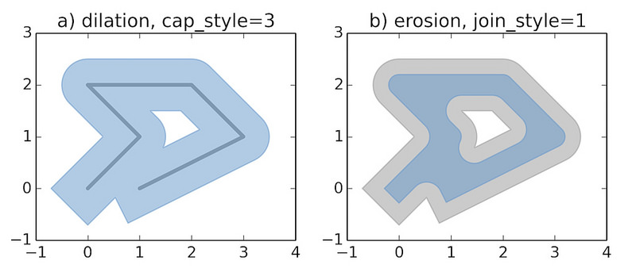
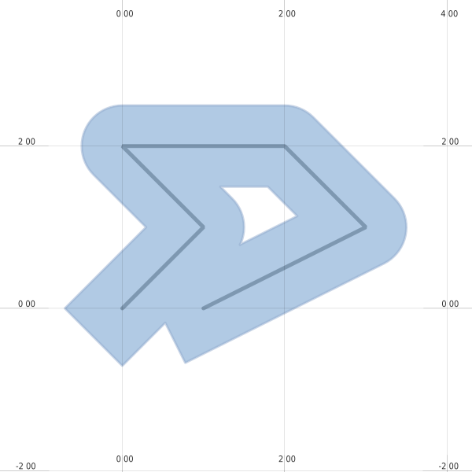
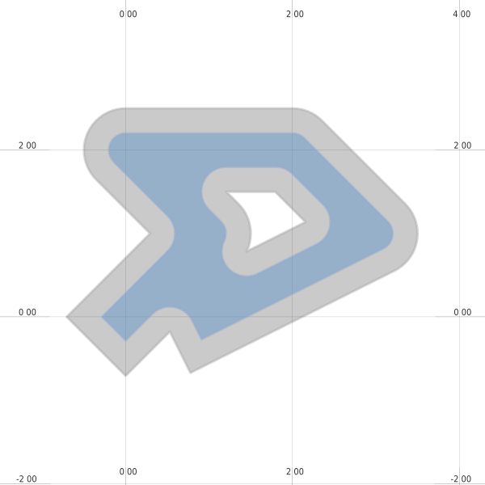

Integrating with Python
=======================

This page gives some examples of integrating mappyfile into Python based work flows. 

Displaying Geometry
-------------------

The examples below recreates the sample images used in the `Shapely documentation <https://pypi.python.org/pypi/Shapely>`_.

See :download:`geometry.py <examples/geometry/geometry.py>` and :download:`geometry.map <examples/geometry/geometry.map>`. 

.. code-block:: python

    mapfile["size"] = [600, 600]

Dilated
+++++++

.. literalinclude:: examples/geometry/geometry.py
   :pyobject: dilation

Eroded
++++++

.. literalinclude:: examples/geometry/geometry.py
   :pyobject: erosion

Shadows and Shading
-------------------

.. raw:: html

    

    

    

Animated Buffers
----------------

.. image:: images/animation.gif

See :download:`animated_buffer.py <examples/animation/animated_buffer.py>` and :download:`animated_buffer.map <examples/animation/animated_buffer.map>`. 

..
    Colormaps http://matplotlib.org/cmocean/
    https://pypi.python.org/pypi/colour