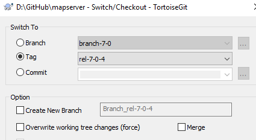

.. _testing:

Testing mappyfile
=================

There are two main objectives:

#. Check that mappyfile can parse all the test Mapfiles in the test suite. 
#. Check that mappyfile can parse the Mapfile, pretty print it to a new file, run the tests on the new file, and check that the output is the same
   as the original. 

The Mapfiles won't be identical as comments will be stripped, and whitespace will change. They should however produce the same results. 

Testing - there are many sample Mapfiles available in the testing suite of MapServer:

+ https://github.com/mapserver/mapserver/tree/master/msautotest/misc
+ https://github.com/mapserver/mapserver/tree/master/msautotest/wxs
+ https://github.com/mapserver/mapserver/tree/master/msautotest/renderers
+ https://github.com/mapserver/mapserver/tree/master/msautotest/gdal

These have been downloaded and added to the ``/tests`` folder. This folder also contains a script to download these files again in the future.

Running the Test Suite
----------------------

.. code-block:: bat

	set MSAUTOTEST_ROOT=D:\GitHub\mapserver\msautotest
	C:\Python27\Scripts\virtualenv.exe C:\VirtualEnvs\msautotest
	cd C:\VirtualEnvs\msautotest\Scripts
	activate
	pip install lxml

	C:\MapServer\SDKShell.bat

	cd /D %MSAUTOTEST_ROOT%
	python ../pymod/xmlvalidate.py -download_ogc_schemas

	cd %MSAUTOTEST_ROOT%\gdal
	mklink /j SCHEMAS_OPENGIS_NET %MSAUTOTEST_ROOT%\SCHEMAS_OPENGIS_NET
	python.exe run_test.py > results.log

	mklink /j D:\Docs E:\Users\Kari\Documents

	cd /D %MSAUTOTEST_ROOT%/misc
	mklink /j SCHEMAS_OPENGIS_NET %MSAUTOTEST_ROOT%\SCHEMAS_OPENGIS_NET
	python.exe run_test.py > results.log

Can add -v for verbose output

python.exe run_test.py -v

15 failures. 

	set MSAUTOTEST_MF_ROOT=D:\GitHub\mapserver\msautotest_mappyfile

	cd /D %MSAUTOTEST_MF_ROOT%
	cd gdal
	mklink /j SCHEMAS_OPENGIS_NET %MSAUTOTEST_ROOT%\SCHEMAS_OPENGIS_NET
	python.exe run_test.py -v > results.log

cd C:\Temp\msautotest\misc
python.exe run_test.py

cd %MSAUTOTEST_ROOT%\pymod
python msautotest_viewer.py

Setup Instructions
------------------

Download a compiled version of MapServer

http://www.gisinternals.com/release.php
http://www.gisinternals.com/query.html?content=filelist&file=release-1800-x64-gdal-2-1-3-mapserver-7-0-4.zip
http://download.gisinternals.com/sdk/downloads/release-1800-x64-gdal-2-1-3-mapserver-7-0-4.zip

Clone the MapServer repository

https://github.com/mapserver/mapserver

Switch to the release tag of the compiled version of MapServer

.. code-block:: bat

	xcopy C:\MapServer\bin\ms\apps\* C:\MapServer\bin

Update the path to the MapServer binaries, and the location of the msautotest folder

.. code-block:: python

	if __name__ == '__main__':
		logging.basicConfig(level=logging.DEBUG)
		fld = r"D:\GitHub\mapserver\msautotest"
		dll_location = r"C:\MapServer\bin"
		main(fld, dll_location)
		print("Done!")

Failing tests:

DEBUG:root:'utf8' codec can't decode byte 0xdf in position 7851: invalid continuation byte
ERROR:root:Please check the encoding for D:\GitHub\mapserver\msautotest\wxs\wms_inspire_scenario1.map. All Mapfiles should be in utf-8 format. 